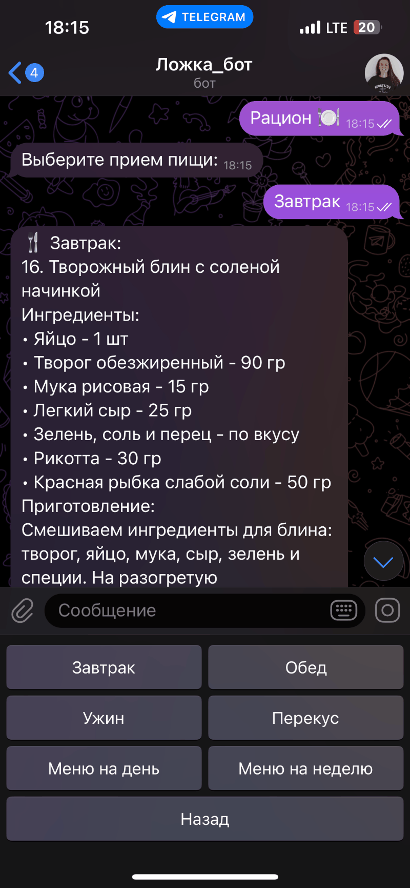

# Telegram Бот: Рандомайзер рациона "Ложка_бот"

  

---

## Описание проекта

**Бот** предлагает случайный рецепт на выбранный приём пищи или составляет сбалансированный рацион на день или неделю.
Меню формируется из более чем 100 рецептов, а список покупок автоматически сохраняется в Excel-файл.

**Цели проекта** - избавить пользователей от ежедневного выбора района, упростить закупки, предоставить услуги эксперта по питанию.

**Результаты проекта** - пользователи получают персонализированное меню за 2-3 клика, экономя до 30 минут в день на планировании. Список покупок в Excel упрощает поход в магазин.

**Практическая направленность** - уход от однообразия в еде, экономия времени, снижение стресса при планировании. Сбалансированное меню с расчетом КБЖУ и сопровождением эксперта делает питание более комфортным.

---

## Этапы разработки

### Этап 1: Локальный бот (`main01.py`)


**Функционал:**

- Обработка базовых команд
- FSM (машина состояний)
- Простая клавиатура

**Зависимости:**

```txt
aiogram==3.3.0
```

**Запуск:**

```txt
python3 tg_bot_1.py
```

### Этап 2: Расширенный бот с БД и Excel (`main02.py`)



**Дополнительно:**

* Подключение к PostgreSQL (`diet_bot_db`)
* Excel-отчёты со списками продуктов
* Поддержка подписокs
* Inline-кнопки, переключение меню
* Поддержка эксперта по питанию
* Работа с сервером Timeweb

**Зависимости:**

```txt
aiogram==3.3.0
asyncpg==0.29.0
openpyxl==3.1.2
python-dotenv==1.0.1
```

**Запуск:**

```txt
python tg_bot_2.py
```

## Используемые технологии:

* [Aiogram 3]()
* PostgreSQL (через `asyncpg`)
* Excel через `openpyxl`
* FSM и кастомные кнопки
* VPS-сервер Timeweb
